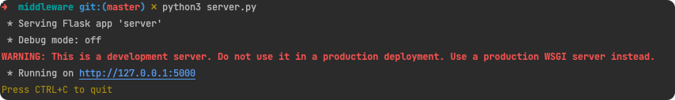

# Horaires de marées avec Vue JS

Un projet graphique melant du SVG, du Vue JS pour afficher l'état de la marée.

## Mise en place

### Middleware

En python, ce middleware va permettre de faire des requêtes sur les horaires de marée auprès du site shom.fr

```bash
python middleware/server.py
```



### Client VueJS


## Project setup
```
npm install
```

### Compiles and hot-reloads for development
```
npm run serve

##
```

### Compiles and minifies for production
```
npm run build
```

### Lints and fixes files
```
npm run lint
```

### Customize configuration
See [Configuration Reference](https://cli.vuejs.org/config/).
